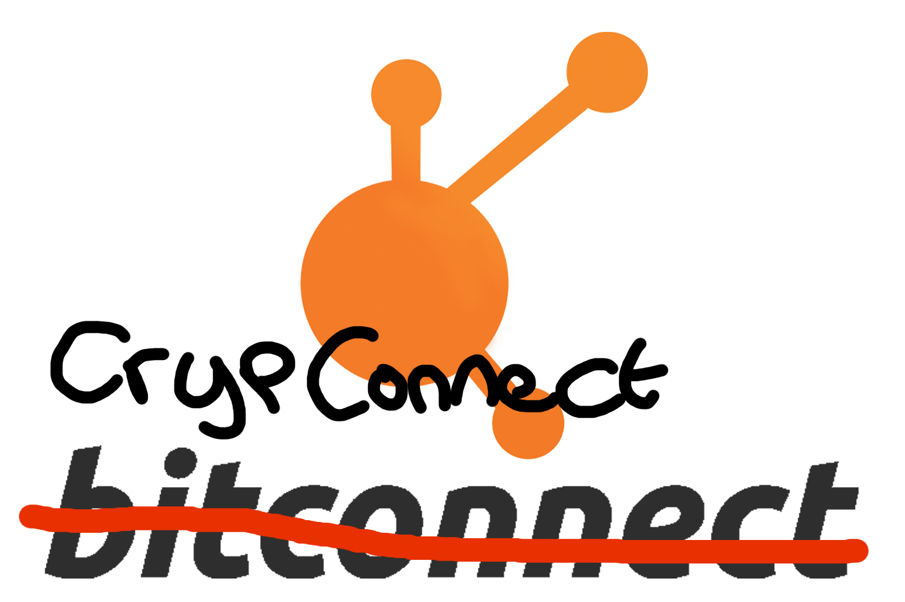

WIP - C# Exchange-Agnostic API for various Crypto Exchanges

Supported exchanges:

 - Binance
 - Cryptopia
 - Kucoin
 - GDax
 - EtherDelta (broken!)

Features:

 - Auto-Refresh and Throttle
 - Single Coin object per Cryptocurrency
   - Best Ask/Bid for each Book/Exchange
 - Events:
   - Coin price updated
 - Filters out Coins in Maintenance (Cryptopia only and does not refresh)

## Setup

 - Open CrypConnect.sln
 - In the "Package Manager Console", run:

```
update-package -reinstall
```


# Stuff

 - Use the Thumbs Up emote on Issues you would like prioritized.
 